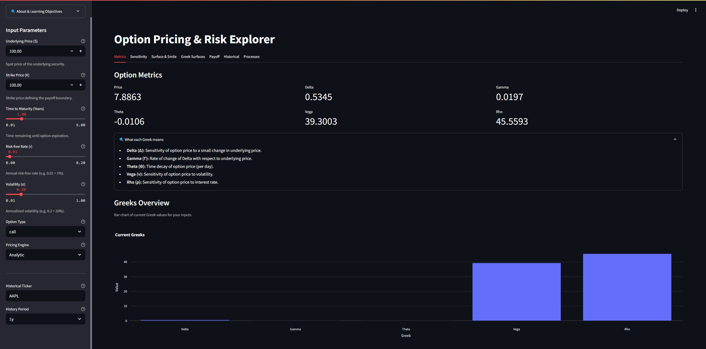
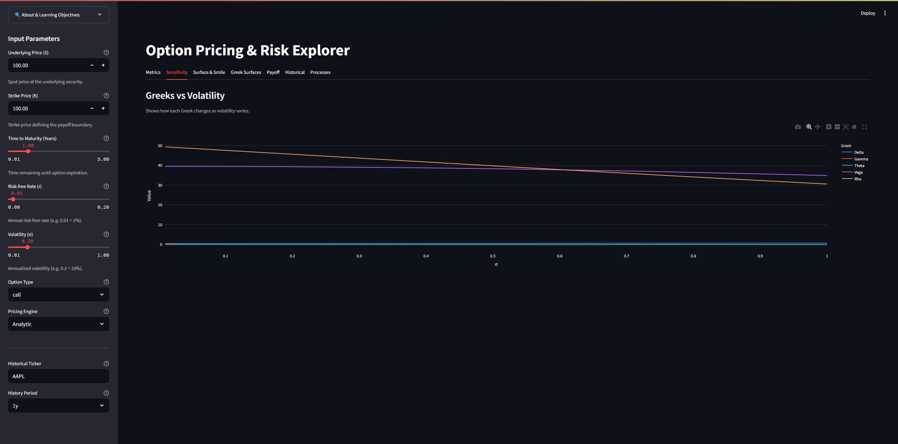
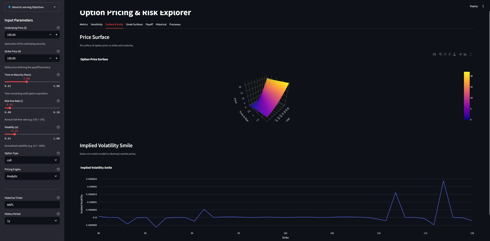
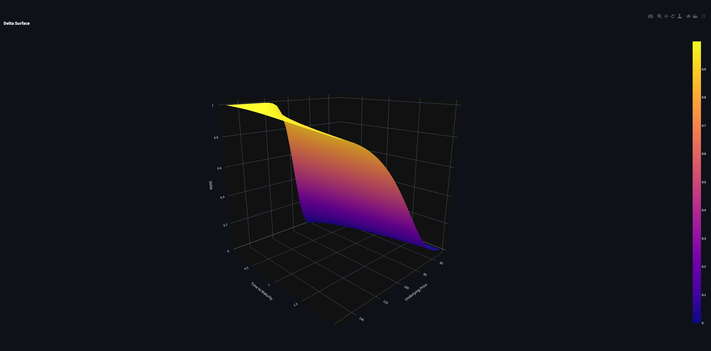
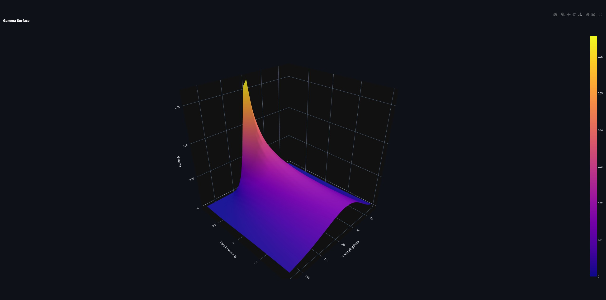
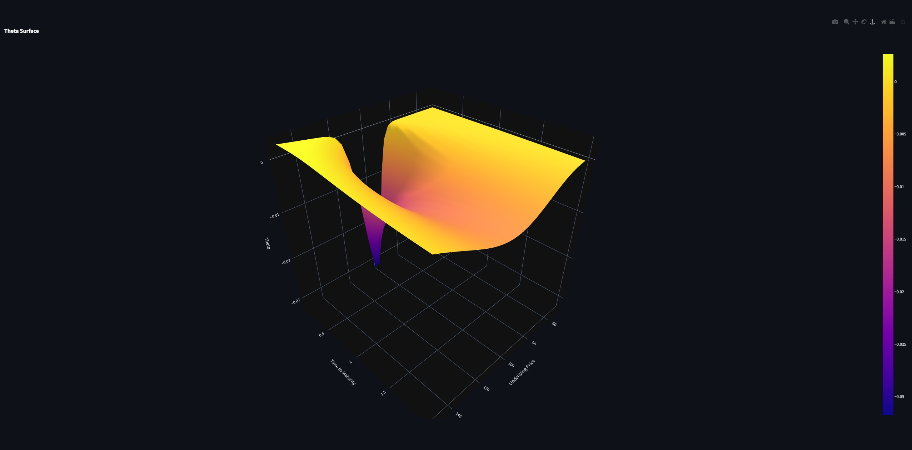
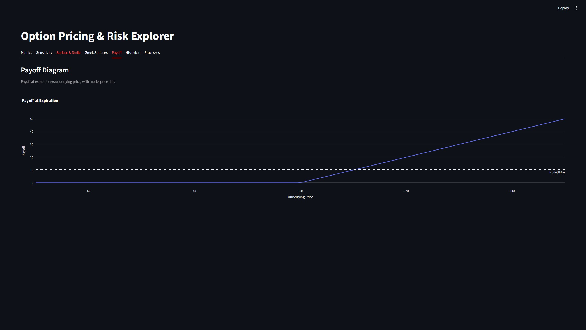
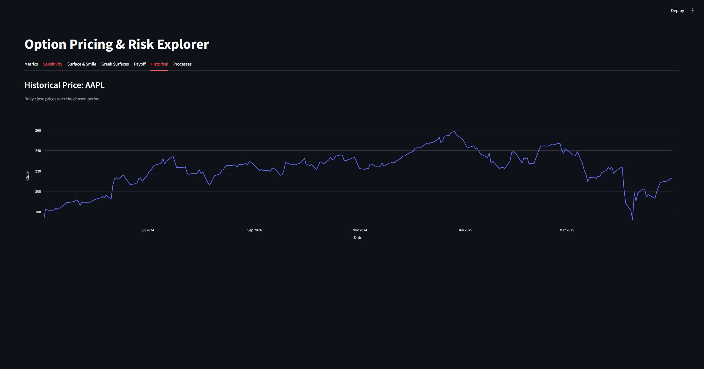
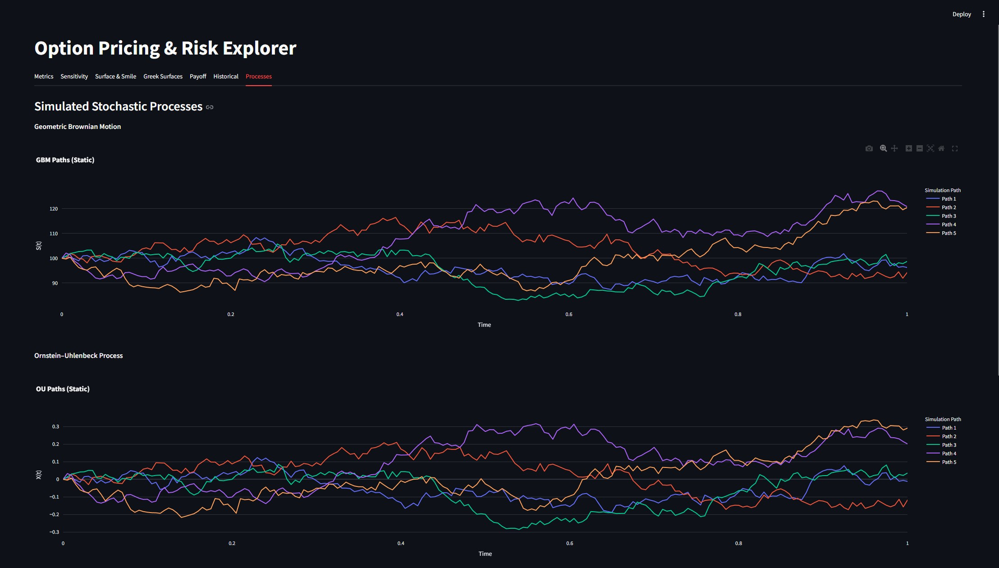
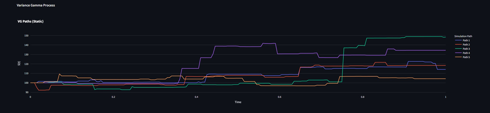

# Option Pricing & Risk Explorer

An interactive Streamlit dashboard for pricing European options, computing Greeks, visualizing stochastic processes, and exploring advanced risk analytics. Under the hood it uses QuantLib for Black-Scholes and binomial-tree pricing, Plotly for rich visualizations, and yfinance/pandas for historical data.

---

## Table of Contents
- [Features](#features)
- [Input Parameters](#input-parameters)
- [Installation & Quickstart](#installation--quickstart)
- [Repository Structure](#repository-structure)
- [References](#references)
- [Roadmap](#roadmap)
- [Contributing](#contributing)
- [License](#license)

---

## Features

### 1. Pricing Engines  
- **Analytic Black-Scholes**  
  - Closed-form calculation of European call & put prices.  
  - Uses QuantLib’s `AnalyticEuropeanEngine` for consistency and speed.  
- **Binomial-Tree Models**  
  - Cox-Ross-Rubinstein, Jarrow-Rudd, Tian, Trigeorgis, Leisen-Reimer.  
  - Customizable number of steps (10–2 000) and tree type.  

### 2. Greeks & Risk Measures  
- **Delta (Δ):** ∂Price/∂S — how much the option price moves when the underlying moves.  
- **Gamma (Γ):** ∂²Price/∂S² — curvature of the price profile.  
- **Theta (Θ):** ∂Price/∂t — time-decay per day.  
- **Vega (ν):** ∂Price/∂σ — sensitivity to volatility changes.  
- **Rho (ρ):** ∂Price/∂r — sensitivity to interest rate changes.  

### 3. Interactive Visualizations  
- **Metrics Overview**  
  - Real-time metric cards plus a bar chart of current Greeks.  
- **Greeks vs. Volatility**  
  - Line chart showing each Greek’s behavior as σ varies from 1 % to 100 %.  
- **3D Price Surface**  
  - Price over a mesh of strikes (80–120 % of S) and maturities (0.1–2 yrs).  
- **Implied Volatility Smile**  
  - Solve for σ that matches model or market prices across strikes.  
- **3D Greek Surfaces**  
  - Surfaces for Δ, Θ, Γ over grids of (S,T) or (K,T).  
- **Payoff Diagram**  
  - At-expiration payoff vs. underlying price, with model price overlay.  
- **Historical Prices**  
  - Fetches daily close data via yfinance for any ticker (1 mo, 3 mo, 6 mo, 1 yr).  
- **Stochastic Processes**  
  - Static simulations of GBM, Ornstein–Uhlenbeck, and Variance Gamma paths.  

---

## Screenshots

### Metrics & Greeks Overview


### Greeks vs. Volatility


### 3D Price Surface & Smile


### Delta Surface


### Gamma Surface


### Theta Surface


### Payoff Diagram


### Historical Price Chart


### GBM / OU / VG Paths
  


---

## Input Parameters

| Control                   | Type           | Range / Options           | Description                                                               |
|---------------------------|----------------|---------------------------|---------------------------------------------------------------------------|
| **Underlying Price (S)**  | Number input   | 0.01 – 1 000.00            | Spot price of the underlying asset.                                       |
| **Strike Price (K)**      | Number input   | 0.01 – 1 000.00            | Exercise price of the option.                                             |
| **Time to Maturity (T)**  | Slider         | 0.01 – 5.00 years         | Time until expiration (0.5 = 6 months).                                   |
| **Risk-free Rate (r)**    | Slider         | 0.00 – 0.20 (0 %–20 %)     | Continuously compounded annual risk-free rate (decimal).                  |
| **Volatility (σ)**        | Slider         | 0.01 – 1.00 (1 %–100 %)    | Annualized volatility (decimal).                                          |
| **Option Type**           | Dropdown       | `call`, `put`             | **call** = right to buy, **put** = right to sell.                         |
| **Pricing Engine**        | Dropdown       | `Analytic`, `Binomial`    | Analytic BS or discrete binomial tree.                                    |
| **Binomial Steps**        | Number input   | 10 – 2 000                | (Binomial only) number of time steps in the tree.                         |
| **Binomial Tree**         | Dropdown       | `crr`, `jr`, `td`, `tr`, `lr` | (Binomial only) tree type: Cox-Ross-Rubinstein, Jarrow-Rudd, etc.           |
| **Historical Ticker**     | Text input     | e.g. `AAPL`, `TSLA`       | Ticker symbol for fetching historical data via Yahoo Finance.             |
| **History Period**        | Dropdown       | `1y`, `6mo`, `3mo`, `1mo`  | Time window for historical charting.                                       |

---

## Installation & Quickstart

1. **Clone & Create venv**  
   ```bash
   git clone https://github.com/yourusername/option-greeks-dashboard.git
   cd option-greeks-dashboard
   python -m venv .venv
   source .venv/bin/activate   # or .\.venv\Scripts\activate on Windows
   ```
2. **Install**
   ```bash
   pip install -r requirements.txt
   pip install -e .
   ```
3. **Run**
   ```bash
   streamlit run src/option_greeks_dashboard/ui/app.py
   ```
---

## Repository Structure

```arduino
option-greeks-dashboard/
├── src/
│   └── option_greeks_dashboard/
│       ├── data/
│       │   └── loader.py
│       ├── greeks/
│       │   └── compute.py
│       ├── pricing/
│       │   └── black_scholes.py
│       ├── ui/
│       │   └── app.py
│       └── utils/
│           ├── helpers.py
│           └── plotting.py
├── tests/
│   ├── helpers.py
│   └── loader.py
├── README.md
├── requirements.txt
└── setup.py
```

---

## References

- QuantLib: https://www.quantlib.org/
- Streamlit: https://streamlit.io/
- Plotly: https://plotly.com/python/
- yfinance: https://pypi.org/project/yfinance/

---

## Roadmap
- Add implied vol solver for real market quotes  
- Backtest simple option strategies  
- Export charts to PDF/PNG  
- Support American options via binomial early exercise  

## Contributing
1. Fork the repo  
2. Create a feature branch (`git checkout -b feature/foo`)  
3. Commit your changes (`git commit -am 'Add feature'`)  
4. Push to the branch (`git push origin feature/foo`)  
5. Open a Pull Request  

## License
This project is licensed under the MIT License – see the [LICENSE](LICENSE) file for details.
